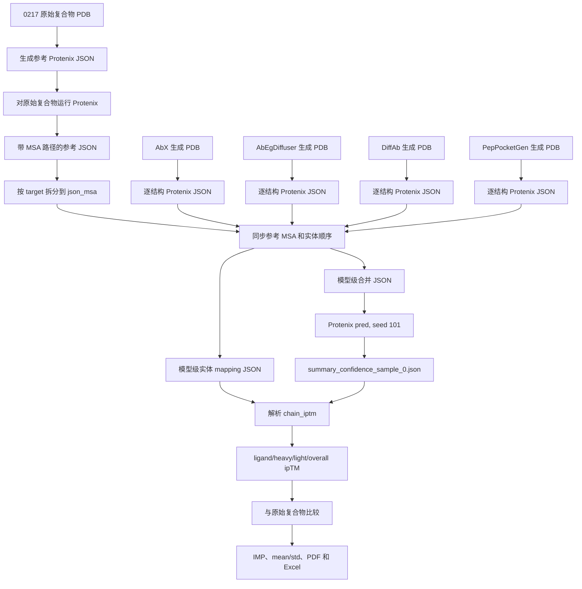

# Protenix ipTM 评估全流程

本文档说明 0217 benchmark 中 AbX、AbEgDiffuser、DiffAb 和 PepPocketGen 从生成结构到最终 ipTM 统计结果的完整流程，包括每一步对应的代码、输入、输出和具体处理逻辑。

## 1. 流程总览



公共主线是：

1. 为原始 0217 测试集准备带 MSA 的参考 Protenix JSON。
2. 将各生成模型输出的 PDB 转成 Protenix JSON。
3. 根据 PDB 实体名称和顺序，把参考蛋白链的 MSA 路径同步到生成结构 JSON。
4. 同时保存每个生成结构的实体顺序 mapping。
5. 用相同的 Protenix checkpoint 和 seed 预测所有生成复合物。
6. 从 Protenix 结果提取整体 `iptm` 和逐实体 `chain_iptm`。
7. 根据 mapping 将 `chain_iptm` 还原成 antigen/ligand、heavy chain 和 light chain 分数。
8. 与原始复合物的分数比较，计算 improvement ratio、均值和标准差。

## 2. 关键代码位置

| 功能 | 代码位置 |
| --- | --- |
| 原始测试集 JSON/MSA 准备及历史总流程 | [`../../antibody_design/testset/0217/structure_prediction/pipeline.sh`](../../antibody_design/testset/0217/structure_prediction/pipeline.sh) |
| 单目录 PDB 批量转 Protenix JSON | [`../../antibody_design/testset/0217/structure_prediction/gen_json.sh`](../../antibody_design/testset/0217/structure_prediction/gen_json.sh) |
| AbX、AbEgDiffuser、DiffAb PDB 批量转 JSON | [`../../antibody_design/testset/0217/structure_prediction/convert_json_batch.py`](../../antibody_design/testset/0217/structure_prediction/convert_json_batch.py) |
| JSON 合并和拆分 | [`../../antibody_design/testset/0217/structure_prediction/merge_json.py`](../../antibody_design/testset/0217/structure_prediction/merge_json.py) |
| 实体识别、MSA 同步、名称统一和 mapping 生成 | [`../../antibody_design/testset/0217/structure_prediction/sync_msa.py`](../../antibody_design/testset/0217/structure_prediction/sync_msa.py) |
| PepPocketGen 三步流水线 | [`../../antibody_design/testset/0217/structure_prediction/ppg_pipeline.sh`](../../antibody_design/testset/0217/structure_prediction/ppg_pipeline.sh) |
| baseline H3 流水线示例 | [`../../antibody_design/testset/0217/structure_prediction/baseline_pipeline.sh`](../../antibody_design/testset/0217/structure_prediction/baseline_pipeline.sh) |
| Protenix Slurm 启动示例 | [`../../antibody_design/testset/0217/structure_prediction/predict.slurm`](../../antibody_design/testset/0217/structure_prediction/predict.slurm) |
| ipTM 提取、映射、聚合、绘图和导表 | [`score_benchmark.ipynb`](score_benchmark.ipynb) 的 `## Protenix score` 部分 |

脚本中仍保留很多 `/home/kechen/...` 历史绝对路径。本文用 `<workspace>`、`<testset_root>` 和 `<run_path>` 表示应按当前环境替换的路径：

```text
<workspace>     = /home/kchlu/link_name
<testset_root>  = <workspace>/peptide/antibody_design/testset/0217
<structure_dir> = <testset_root>/structure_prediction
<run_path>      = 某个 PepPocketGen inference run 输出目录
```

## 3. Stage 0：准备原始参考结构和 MSA

后续所有生成模型都复用原始复合物的 protein-chain MSA，因此必须先完成参考集准备。

### 3.1 输入

原始复合物按抗原类型存放，例如：

```text
<testset_root>/peptide_standard/*.pdb
<testset_root>/peptide_non_standard/*.pdb
<testset_root>/hapten/*.pdb
<testset_root>/sugar/*.pdb
```

历史 [`pipeline.sh`](../../antibody_design/testset/0217/structure_prediction/pipeline.sh) 中使用过 `peptide/`、`hapten/` 和 `sugar/`。当前 `item_type_mapping` 使用的是 `peptide_standard`、`peptide_non_standard`、`hapten` 和 `sugar`，实际运行前应以磁盘目录为准统一名称。

原始 target 名统一采用：

```text
<PDB ID>_<antigen chain>_<heavy chain>_<light chain>
```

例如：

```text
1a6w_A_H_L
7rm0_Q_C_D
```

### 3.2 PDB 转参考 JSON

代码：[`gen_json.sh`](../../antibody_design/testset/0217/structure_prediction/gen_json.sh)

对输入目录中的每个 PDB 执行：

```bash
protenix json \
  --input <reference.pdb> \
  --out_dir <structure_dir>/json \
  --altloc first
```

输入：

```text
<testset_root>/<antigen_type>/<target>.pdb
```

输出：

```text
<structure_dir>/json/<target>.json
```

这一步从 PDB 中提取 protein chain、peptide chain 或 ligand，形成 Protenix 的 `sequences` 列表。

### 3.3 合并参考 JSON

代码：[`merge_json.py`](../../antibody_design/testset/0217/structure_prediction/merge_json.py) 的 `merge_json_files()`。

```bash
python merge_json.py \
  -i <structure_dir>/json \
  -o <structure_dir>/testset_0217.json \
  -m merge
```

输入：

```text
<structure_dir>/json/*.json
```

输出：

```text
<structure_dir>/testset_0217.json
```

输出是一个 JSON list，每个元素对应一个原始复合物。

### 3.4 对参考复合物运行 Protenix

历史命令位于 [`pipeline.sh`](../../antibody_design/testset/0217/structure_prediction/pipeline.sh)：

```bash
export LAYERNORM_TYPE=torch
protenix pred \
  -i <structure_dir>/testset_0217-update-msa.json \
  -o <structure_dir>/output \
  -s 101 \
  -n protenix_base_20250630_v1.0.0
```

主要输出：

```text
<structure_dir>/output/<target>/seed_101/predictions/
<structure_dir>/output/<target>/msa/
```

带 MSA 路径的参考输入保存在：

```text
<structure_dir>/testset_0217-update-msa.json
```

后续流程真正依赖的是该 JSON 中每个 proteinChain 的：

```text
pairedMsaPath
unpairedMsaPath
```

### 3.5 按 target 拆分参考 MSA JSON

代码：[`merge_json.py`](../../antibody_design/testset/0217/structure_prediction/merge_json.py) 的 `split_json_files()`。

```bash
python merge_json.py \
  -i <structure_dir>/testset_0217-update-msa.json \
  -o <structure_dir>/json_msa \
  -m split
```

输入：

```text
<structure_dir>/testset_0217-update-msa.json
```

输出：

```text
<structure_dir>/json_msa/<target>.json
```

例如：

```text
<structure_dir>/json_msa/1a6w_A_H_L.json
```

每个文件仍是单元素 JSON list。后面的同步代码读取 `ref_data[0]` 作为参考条目。

### 3.6 生成原始实体顺序 mapping

代码：[`score_benchmark.ipynb`](score_benchmark.ipynb) 中 `get_pdb_entities_with_counts()` 和 `chain_mapping_info_orig` 构建部分；相同函数也在 [`sync_msa.py`](../../antibody_design/testset/0217/structure_prediction/sync_msa.py) 中实现。

输入：

```text
<testset_root>/<antigen_type>/<target>.pdb
```

输出：

```text
<structure_dir>/orig_mapping.json
```

格式示例：

```json
{
  "1a6w_A_H_L": ["H", "L", "NIP"],
  "7rm0_Q_C_D": ["Q", "C", "D"]
}
```

该顺序用于解释原始结构 Protenix 输出中的 `chain_iptm`。

## 4. 公共步骤：识别 PDB 实体顺序

代码：[`sync_msa.py`](../../antibody_design/testset/0217/structure_prediction/sync_msa.py) 的 `get_pdb_entities_with_counts()`。

函数使用 `Bio.PDB.PDBParser` 遍历 PDB，按照 PDB 中的出现顺序生成实体列表。

规则如下：

| PDB 内容 | mapping 中的表示 | 说明 |
| --- | --- | --- |
| 连续 `ATOM` 蛋白残基 | `H`、`L`、`P` | 使用 chain ID |
| 同一 chain ID 中被 HETATM/水打断后再次出现的蛋白段 | `A_1`、`A_2` | 用后缀区分链段 |
| `HETATM` 小分子 | `NIP_1`、`RAM_2` | 使用 residue name 和该名称的总数量 |
| 水分子 | 不记录 | `het_flag == "W"` 时跳过 |

需要保存实体顺序，因为 Protenix 的：

```json
"chain_iptm": [score_0, score_1, score_2]
```

只给出数组，不直接提供原始 PDB chain ID。第 `i` 个分数必须通过 mapping 第 `i` 个实体解释。

## 5. 公共步骤：同步参考 MSA

代码：[`sync_msa.py`](../../antibody_design/testset/0217/structure_prediction/sync_msa.py) 的 `sync_msa_paths()`。

### 5.1 输入

- `target_item`：由生成 PDB 得到的 Protenix JSON 条目。
- `ref_item`：`json_msa/<target>.json` 中的参考条目。
- `sample_order`：生成 PDB 的实体顺序。
- `ref_order`：原始 PDB 的实体顺序。

### 5.2 实体配对

对生成实体逐个按名称查找参考实体：

```python
for target_index, chain_name in enumerate(sample_order):
    if chain_name in ref_order:
        reference_index = ref_order.index(chain_name)
```

只有两侧对应项都是 `proteinChain` 且都包含 `sequence` 时，才同步序列长度和 MSA。小分子 ligand 不需要 MSA。

### 5.3 长度处理

若生成序列比参考序列短：

```python
target_sequence = target_sequence + reference_sequence[-length_difference:]
```

若生成序列比参考序列长：

```python
target_sequence = target_sequence[:reference_length]
```

### 5.4 MSA 路径复制

从参考 proteinChain 复制：

```text
pairedMsaPath
unpairedMsaPath
```

到生成 proteinChain。最终生成序列仍保留设计模型产生的突变，但使用原始 target 的 MSA 文件。

## 6. AbX 分支

### 6.1 输入路径

All-CDR：

```text
/home/kechen/antibody_design/AbX/output/
```

CDRH3-only：

```text
/home/kechen/antibody_design/AbX/output_H3/
```

单个 target 的目录结构：

```text
<AbX output>/<PDB>_<H>_<L>_<antigen>/design/
|-- 0000/<PDB>_<H>_<L>_<antigen>.pdb
|-- 0001/<PDB>_<H>_<L>_<antigen>.pdb
`-- ...
```

默认读取 `0000` 到 `0007`，即每个 target 8 个设计。

### 6.2 逐 PDB 生成 JSON

代码：[`convert_json_batch.py`](../../antibody_design/testset/0217/structure_prediction/convert_json_batch.py) 的 `convert_json_abx()`。

命令：

```bash
python convert_json_batch.py --model abx --mode cdrs
python convert_json_batch.py --model abx --mode h3
```

对每个 PDB 执行：

```bash
protenix json --input <sample.pdb> --out_dir <sample_dir> --altloc first
```

输出位于对应 `000i/` 目录：

```text
<sample_dir>/<PDB>_<H>_<L>_<antigen>.json
```

### 6.3 名称统一、MSA 同步和合并

代码：[`sync_msa.py`](../../antibody_design/testset/0217/structure_prediction/sync_msa.py) 的 `process_abx()`。

AbX 输入名称顺序是：

```text
<PDB>_<H>_<L>_<antigen>
```

统一后改成：

```text
<PDB>_<antigen>_<H>_<L>_<sample_id>
```

例如：

```text
1qkz_H_L_P -> 1qkz_P_H_L_0
```

随后：

1. 解析生成 PDB 得到 `sample_order`，例如 `["H", "L", "P"]`。
2. 读取 `<structure_dir>/json_msa/1qkz_P_H_L.json`。
3. 解析原始 PDB 得到 `ref_order`。
4. 按实体名称同步 proteinChain MSA。
5. 将统一后的条目追加到模型级 JSON。
6. 保存 item 名到实体顺序的 mapping。

命令：

```bash
python sync_msa.py --model abx --mode cdrs
python sync_msa.py --model abx --mode h3
```

输出：

```text
<structure_dir>/abx_0217.json
<structure_dir>/abx_0217_mapping.json
<structure_dir>/abx_h3_0217.json
<structure_dir>/abx_h3_0217_mapping.json
```

当前 `process_abx()` 将参考抗原类型目录固定为 `peptide_standard`，所以该分支按现有代码只适用于 peptide benchmark。

## 7. DiffAb 分支

### 7.1 输入路径

All-CDR 使用：

```text
/home/kechen/antibody_design/diffab/results/hapten_non_ligand/codesign_multicdrs
/home/kechen/antibody_design/diffab/results/sugar_non_ligand/codesign_multicdrs
/home/kechen/antibody_design/diffab/results/peptide_standard/codesign_multicdrs
```

CDRH3-only 使用对应的 `codesign_single` 目录。

单 target 的设计 PDB 位于：

```text
<target directory>/MultipleCDRs_with_ligand/0000.pdb  # hapten/sugar All-CDR
<target directory>/MultipleCDRs/0000.pdb              # peptide All-CDR
<target directory>/H_CDR3_with_ligand/0000.pdb        # hapten/sugar H3
<target directory>/H_CDR3/0000.pdb                    # peptide H3
```

每个 target 默认读取 `0000.pdb` 到 `0007.pdb`。

### 7.2 逐 PDB 生成 JSON

代码：[`convert_json_batch.py`](../../antibody_design/testset/0217/structure_prediction/convert_json_batch.py) 的 `convert_json()`。

```bash
python convert_json_batch.py \
  --model diffab \
  --mode cdrs \
  --subdir_name MultipleCDRs_with_ligand

python convert_json_batch.py \
  --model diffab \
  --mode h3 \
  --subdir_name H_CDR3_with_ligand
```

对于 peptide，代码自动移除 `_with_ligand` 后缀。

输出：

```text
<target directory>/<design subdir>/0000.json
...
<target directory>/<design subdir>/0007.json
```

### 7.3 MSA 同步和合并

代码：[`sync_msa.py`](../../antibody_design/testset/0217/structure_prediction/sync_msa.py) 的 `process_diffab_abeg()`。

处理逻辑：

1. 从生成目录名去掉 `.pdb` 后缀，得到原始 target 名。
2. 第 `i` 个设计统一命名为 `<target>_<i>`。
3. 从生成 PDB 得到 `sample_order`。
4. 从原始 PDB 得到 `ref_order`。
5. 从 `json_msa/<target>.json` 同步 MSA。
6. 合并所有抗原类型和设计样本。
7. 保存每个 item 的实体顺序。

命令：

```bash
python sync_msa.py --model diffab --mode cdrs
python sync_msa.py --model diffab --mode h3
```

输出：

```text
<structure_dir>/diffab_0217.json
<structure_dir>/diffab_0217_mapping.json
<structure_dir>/diffab_h3_0217.json
<structure_dir>/diffab_h3_0217_mapping.json
```

## 8. AbEgDiffuser 分支

### 8.1 输入路径

AbEgDiffuser 当前只进入 CDRH3 评估：

```text
/home/kechen/antibody_design/AbEgDiffuser/results/hapten_non_ligand/codesign_single
/home/kechen/antibody_design/AbEgDiffuser/results/sugar_non_ligand/codesign_single
/home/kechen/antibody_design/AbEgDiffuser/results/peptide_standard/codesign_single
```

生成 PDB 子目录与 DiffAb H3 分支相同：

```text
H_CDR3_with_ligand/0000.pdb  # hapten/sugar
H_CDR3/0000.pdb              # peptide
```

### 8.2 逐 PDB 生成 JSON

代码：[`convert_json_batch.py`](../../antibody_design/testset/0217/structure_prediction/convert_json_batch.py)。

```bash
python convert_json_batch.py \
  --model abeg \
  --subdir_name H_CDR3_with_ligand
```

输出：

```text
<target directory>/<H3 subdir>/0000.json
...
<target directory>/<H3 subdir>/0007.json
```

### 8.3 MSA 同步和合并

代码同样是 `process_diffab_abeg()`：

```bash
python sync_msa.py --model abeg --mode h3
```

输出：

```text
<structure_dir>/abeg_0217.json
<structure_dir>/abeg_0217_mapping.json
```

因为 AbEgDiffuser 是 H3-only 方法，notebook 后续把模型名包含 `abeg` 的行划入 `H3-related`。

## 9. PepPocketGen 分支

PepPocketGen 使用 [`ppg_pipeline.sh`](../../antibody_design/testset/0217/structure_prediction/ppg_pipeline.sh) 串联 JSON 生成、MSA 同步和 Protenix 推理。

### 9.1 输入路径和文件名

输入是某次 inference 的 run 目录：

```text
<run_path>/*.pdb
```

典型 PDB 文件名：

```text
1a6w_A_H_L_0_gen_len_48_H.27-38,56-64,105-117_L.27-38,56-57,105-117.pdb
```

其中 `_gen_len` 之前的部分：

```text
1a6w_A_H_L_0
```

是最终 Protenix item 名；末尾 `_0` 是 PepPocketGen 设计编号。

### 9.2 Step 1：生成逐结构 JSON

代码：[`ppg_pipeline.sh`](../../antibody_design/testset/0217/structure_prediction/ppg_pipeline.sh) 调用 [`gen_json.sh`](../../antibody_design/testset/0217/structure_prediction/gen_json.sh)。

```bash
bash ppg_pipeline.sh -i <run_path> -g <GPU ID>
```

内部执行：

```bash
bash gen_json.sh -i <run_path> -o <run_path>/json
```

输入：

```text
<run_path>/*.pdb
```

输出：

```text
<run_path>/json/<generated PDB basename>.json
```

### 9.3 Step 2：名称解析、MSA 同步和合并

代码：[`sync_msa.py`](../../antibody_design/testset/0217/structure_prediction/sync_msa.py) 的 `process_ppg()`。

内部命令：

```bash
python sync_msa.py \
  --model ppg \
  --mode cdrs \
  --gen_path <run_path> \
  --out_json_name ppg_0217
```

对每个生成 PDB：

1. 取 `_gen_len` 前缀作为 `item_name_with_sample`。
2. 用 `remove_trailing_number()` 删除设计编号，得到原始 target 名。
3. 用 `item_type_mapping` 确定 target 属于 peptide、hapten 或 sugar。
4. 读取 `<run_path>/json/<item_name_with_sample>_gen_len.json`；若不存在，再尝试 `_gen_len_.json`。
5. 读取 `<structure_dir>/json_msa/<target>.json`。
6. 比较生成 PDB 与原始 PDB 的实体顺序并同步 MSA。
7. 将 JSON 中的 `name` 统一设为 `<target>_<sample_id>`。

输出：

```text
<run_path>/ppg_0217.json
<run_path>/ppg_0217_mapping.json
```

### 9.4 Step 3：运行 Protenix

`ppg_pipeline.sh` 内部执行：

```bash
CUDA_VISIBLE_DEVICES=<GPU ID> protenix pred \
  -i <run_path>/ppg_0217.json \
  -o <run_path>/protenix \
  -s 101 \
  -n protenix_base_20250630_v1.0.0
```

输出：

```text
<run_path>/protenix/<item>/seed_101/predictions/
```

notebook 当前纳入以下 PepPocketGen run/model 标签：

| notebook 模型标签 | 含义 |
| --- | --- |
| `peptide` | peptide-finetuned PepPocketGen |
| `ligand` | ligand-finetuned PepPocketGen |
| `pep_addpro` | peptide + protein 数据版本 |
| `ligand_addpro` | ligand + protein 数据版本 |
| `addpro_ablation` | 去掉 pretraining 的消融版本 |
| `ligand_H3` | CDRH3-only 生成版本 |
| `ligand_nocipa` | 去掉 CrossIPA 的消融版本 |

## 10. Protenix 推理的统一输入和输出

所有方法最终使用同一预测配置：

```bash
export LAYERNORM_TYPE=torch

protenix pred \
  -i <model_merged_input.json> \
  -o <model_output_dir> \
  -s 101 \
  -n protenix_base_20250630_v1.0.0
```

模型级输入/输出关系如下：

| 模型 | Protenix 输入 | Protenix 输出根目录 | mapping |
| --- | --- | --- | --- |
| 原始结构 | `<structure_dir>/testset_0217-update-msa.json` | `<structure_dir>/output` | `<structure_dir>/orig_mapping.json` |
| AbX All-CDR | `<structure_dir>/abx_0217.json` | `<structure_dir>/abx_peptide` | `<structure_dir>/abx_0217_mapping.json` |
| AbX H3 | `<structure_dir>/abx_h3_0217.json` | `<structure_dir>/abx_peptide_h3` | `<structure_dir>/abx_h3_0217_mapping.json` |
| DiffAb All-CDR | `<structure_dir>/diffab_0217.json` | `<structure_dir>/diffab` | `<structure_dir>/diffab_0217_mapping.json` |
| DiffAb H3 | `<structure_dir>/diffab_h3_0217.json` | `<structure_dir>/diffab_h3` | `<structure_dir>/diffab_h3_0217_mapping.json` |
| AbEgDiffuser H3 | `<structure_dir>/abeg_0217.json` | `<structure_dir>/abeg` | `<structure_dir>/abeg_0217_mapping.json` |
| PepPocketGen | `<run_path>/ppg_0217.json` | `<run_path>/protenix` | `<run_path>/ppg_0217_mapping.json` |

单个 item 的输出结构为：

```text
<model_output_dir>/<item>/seed_101/predictions/
|-- <item>_sample_0.cif
|-- <item>_summary_confidence_sample_0.json
|-- <item>_sample_1.cif
|-- <item>_summary_confidence_sample_1.json
`-- ...
```

summary JSON 中与本流程最相关的字段是：

```json
{
  "iptm": 0.9527,
  "chain_iptm": [0.9267, 0.9252, 0.8964],
  "chain_pair_iptm": [[0.0, 0.9555, 0.8978]],
  "ptm": 0.9660,
  "plddt": 96.4252,
  "ranking_score": 0.9553
}
```

当前 notebook 只读取：

```text
<item>_summary_confidence_sample_0.json
```

即 Protenix 的其他 prediction samples 没有参与统计。这里的 Protenix `sample_0` 与生成模型 item 名末尾的设计编号 `_0` 到 `_7` 是两个不同层级。

## 11. notebook 提取原始 ipTM 数据

代码：[`score_benchmark.ipynb`](score_benchmark.ipynb) 的 `### Extract score` 部分。

### 11.1 建立模型目录列表

notebook 构造 `all_dir`：

```python
(model_output_directory, model_mapping, model_name)
```

其中包含：

- origin；
- AbX All-CDR 和 H3；
- DiffAb All-CDR 和 H3；
- AbEgDiffuser；
- 多个 PepPocketGen run。

### 11.2 读取 summary JSON

对每个模型输出根目录下的 item，读取：

```text
<model_dir>/<item>/seed_101/predictions/
<item>_summary_confidence_sample_0.json
```

提取：

```python
iptm = data["iptm"]
chain_iptm = data["chain_iptm"]
```

并从对应 mapping 中读取：

```python
mapping[item_name]
```

形成原始 DataFrame：

| 列 | 含义 |
| --- | --- |
| `model` | 模型标签 |
| `item_name` | `<target>` 或 `<target>_<design_id>` |
| `chain_iptm_list` | Protenix 的逐实体 ipTM 数组 |
| `iptm_list` | Protenix 整体 ipTM |
| `chain_list` | mapping 中的实体顺序 |

历史中间结果也保存在：

```text
<structure_dir>/iptm_comparison.csv
```

## 12. 将 chain_ipTM 映射到 antigen、heavy 和 light

代码：notebook 的 `process_iptm()`。

### 12.1 从 item 名获取重链和轻链 ID

标准 item 名格式：

```text
<PDB ID>_<antigen>_<heavy>_<light>_<sample_id>
```

代码使用：

```python
parts = item_name.split("_")
target_heavy = parts[2]
target_light = parts[3]
```

若 heavy/light 字段为空字符串，则设为 `None`。

### 12.2 对齐 mapping 和 chain_ipTM

正常情况下：

```python
len(chain_iptm_list) == len(chain_list)
```

若长度不一致，代码先从 `chain_list` 删除空字符串；若仍不一致，该行返回 NaN。

然后建立：

```python
chain_map = dict(zip(chain_list, chain_iptm_list))
```

### 12.3 计算链级分数

重链和轻链直接按 chain ID 提取：

$$
\mathrm{heavy\_ipTM}=\mathrm{chainMap}[H]
$$

$$
\mathrm{light\_ipTM}=\mathrm{chainMap}[L]
$$

排除 heavy 和 light 后，所有剩余实体的 `chain_iptm` 平均值定义为 antigen/ligand ipTM：

$$
\mathrm{ligand\_ipTM}
=
\frac{1}{|A|}\sum_{c\in A}\mathrm{chain\_ipTM}(c)
$$

因此：

- peptide antigen：剩余 peptide protein chain 的 `chain_iptm`；
- 单一 hapten：小分子实体的 `chain_iptm`；
- 多残基 saccharide：所有非 H/L 实体 `chain_iptm` 的平均值；
- 多链 antigen：所有非 H/L antigen chains 的平均值。

整体分数：

```python
iptm = row["iptm_list"]
```

直接来自 Protenix summary，不由 `chain_iptm` 重新计算。

输出新增列：

```text
ligand_iptm
heavy_iptm
light_iptm
iptm
```

## 13. 连接原始结构并计算 improvement

代码：notebook 的 `process_df()`。

### 13.1 恢复 target 名

对非 origin 行删除末尾设计编号：

```text
1a6w_A_H_L_0 -> 1a6w_A_H_L
```

结果保存为 `item_name_base`，并通过 `item_type_mapping` 得到 `agtype`。

### 13.2 连接原始链级 ipTM

从 origin 行提取：

```text
orig_ligand_iptm
orig_heavy_iptm
orig_light_iptm
```

然后按 `item_name_base` 左连接到各生成模型行。

### 13.3 链级 improvement 指示变量

对链类型 $c$，定义：

$$
I_{m,i}^{(c)}=
\mathbf{1}\left[s_{m,i}^{(c)}>s_{\mathrm{origin}}^{(c)}\right]
$$

代码生成：

```text
ligand_better_than_orig
heavy_better_than_orig
light_better_than_orig
iptm_better_than_orig
```

origin 自身全部设为 False，不参加后续生成模型汇总。

## 14. Improvement ratio 和 ipTM 统计

代码：notebook 的 `summarize_improvement_ratio()`。

### 14.1 分组

首先排除 `model == "origin"`，然后按：

```text
model + agtype
```

分组。`agtype` 包括：

```text
peptide_standard
peptide_non_standard
hapten
sugar
```

### 14.2 Improvement ratio

每类分数仅统计非 NaN 的行：

$$
\mathrm{IMP}_{m,t}^{(c)}
=
\frac{\sum_i I_{m,i}^{(c)}}{N_{m,t,\mathrm{valid}}^{(c)}}
$$

输出：

```text
ligand_better_ratio
heavy_better_ratio
light_better_ratio
iptm_better_ratio
combined_better_ratio
```

### 14.3 mean 和 std 的实际两层聚合

代码从 item 名第五个下划线字段提取设计编号：

```text
sample_id = 0, 1, ..., 7
```

第一层，对相同模型、抗原类型和设计编号下的所有 targets 求平均：

$$
\bar{s}_{m,t,j}
=
\operatorname{mean}_{\mathrm{target}}s_{m,t,j}
$$

第二层，对不同设计编号的平均值计算 mean 和 std：

$$
\mu_{m,t}
=
\operatorname{mean}_{j}\bar{s}_{m,t,j}
$$

$$
\sigma_{m,t}
=
\operatorname{std}_{j}\bar{s}_{m,t,j}
$$

所以当前 std 反映不同设计编号之间的波动，不是 target 间标准差，也不是将所有 target-design 结构直接展开后的标准差。

输出列包括：

```text
ligand_iptm_mean / ligand_iptm_std
heavy_iptm_mean  / heavy_iptm_std
light_iptm_mean  / light_iptm_std
iptm_mean        / iptm_std
```

## 15. 模型名称和 H3 分组

notebook 的显示名称映射包括：

| 内部标签 | 显示名称 |
| --- | --- |
| `abx`, `abx_h3` | AbX |
| `diffab`, `diffab_h3` | DiffAb |
| `abeg` | AbEgDiffuser |
| `ligand`, `ligand_H3` | LGenLig |
| `peptide` | LGenPep |
| `ligand_addpro` | LGenLig+P |
| `pep_addpro` | LGenPep+P |
| `addpro_ablation` | w/o Pretrain |
| `ligand_nocipa` | w/o CrossIPA |

分组规则：

```python
H3-related = 模型名包含 "h3"，或者模型名包含 "abeg"
Non-H3     = 其他模型
```

图例中对应：

```text
H3-related -> CDRH3 Design
Non-H3     -> All CDR Design
```

## 16. 最终输出

### 16.1 图

核心方法图：

```text
analysis/figures/iptm_IMP_core_methods.pdf
```

保留方法：

```text
DiffAb
AbEgDiffuser
AbX
LGenLig
```

需要注意，绘图代码使用的 y 轴数据是：

```python
heavy_better_ratio
```

因此图中标为 `ipTM IMP` 的量，实际是 heavy-chain `chain_iptm` 相对原始重链的改善比例，不是整体复合物 `iptm` 的改善比例。

### 16.2 Excel

输出：

```text
analysis/figures/iptm_summary.xlsx
```

按抗原类型和 H3/All-CDR 分 sheet，例如：

```text
sugar_iptm_h3
sugar_iptm
hapten_iptm_h3
hapten_iptm
peptide_iptm_h3
peptide_iptm
peptide_non_standard_iptm_h3
peptide_non_standard_iptm
```

表格列包括：

```text
Model
Ligand Chain IMP
Heavy Chain IMP
Light Chain IMP
Ligand Chain ipTM
Heavy Chain ipTM
Light Chain ipTM
```

三个 ipTM 列格式化为：

```text
mean +/- std
```

## 17. 当前实现的注意事项

### 17.1 整体 ipTM improvement 的参考列错误

`process_df()` 当前计算：

```python
df["iptm_better_than_orig"] = (
    (df["iptm"] > df["orig_ligand_iptm"])
    & (df["model"] != "origin")
)
```

这里将整体 `iptm` 与原始 `ligand_iptm` 比较，而不是与原始整体 `iptm` 比较。因此当前 `iptm_better_ratio` 不能解释为正确的整体 ipTM improvement ratio。

### 17.2 combined ratio 与注释不一致

注释称 combined ratio 是 ligand、heavy 和 light 三项合并，但代码对全部 bool columns 求和，其中还包含 `iptm_better_than_orig`。由于整体 ipTM comparison 本身存在上一节的问题，`combined_better_ratio` 也会受影响。

### 17.3 MSA 同步不是序列比对

当前长度修正只是在序列尾部补参考残基或截断生成序列。对于包含 insertion/deletion 的 CDR 设计，这可能：

- 改变模型实际生成的序列；
- 使参考 MSA 与生成序列的位置对应错误；
- 影响 Protenix 对生成复合物的评分。

更稳妥的实现应先进行全局/局部序列比对，再决定如何迁移 MSA 或 mask 变长区域。

### 17.4 只使用 Protenix prediction sample 0

Protenix 每个输入 item 可能输出多个 prediction samples，但 notebook 固定读取：

```text
summary_confidence_sample_0.json
```

其他 prediction samples 没有参与均值、best-of-N 或不确定性统计。

### 17.5 mapping 中重复实体名的覆盖风险

`process_iptm()` 使用：

```python
dict(zip(chains, chain_iptms))
```

如果 `chains` 中存在重复名称，前一个同名实体会被后一个覆盖。多实体配体应确保 mapping 名称唯一，或者改为按索引和实体类型保存。

### 17.6 历史绝对路径

脚本和 notebook 大量包含：

```text
/home/kechen/...
```

当前 workspace 是：

```text
/home/kchlu/link_name/...
```

若没有对应软链接，直接执行会出现 `FileNotFoundError`。建议后续将测试集根目录、模型输出目录和 reference JSON 目录改成命令行参数或统一配置文件。

### 17.7 PepPocketGen 自定义输出名未完全传递

`ppg_pipeline.sh` 支持 `-n JSON_NAME`，但 `sync_msa.py` 的 PPG 主分支调用 `process_ppg()` 时没有传入 `parsed_args.out_json_name`。因此按当前代码，MSA 同步阶段仍使用 `process_ppg()` 默认的 `ppg_0217` 输出名。

## 18. 最小复现顺序

假设参考 MSA 已准备好，最小执行顺序如下。

### 18.1 Baseline

```bash
cd <structure_dir>

# PDB -> 单样本 JSON
python convert_json_batch.py --model diffab --mode cdrs --subdir_name MultipleCDRs_with_ligand
python convert_json_batch.py --model diffab --mode h3 --subdir_name H_CDR3_with_ligand
python convert_json_batch.py --model abeg --mode h3 --subdir_name H_CDR3_with_ligand
python convert_json_batch.py --model abx --mode cdrs
python convert_json_batch.py --model abx --mode h3

# 同步 MSA、统一名称、合并 JSON、生成 mapping
python sync_msa.py --model diffab --mode cdrs
python sync_msa.py --model diffab --mode h3
python sync_msa.py --model abeg --mode h3
python sync_msa.py --model abx --mode cdrs
python sync_msa.py --model abx --mode h3

# 模型级 Protenix 推理，所有命令使用相同 seed/checkpoint
protenix pred -i diffab_0217.json -o diffab -s 101 -n protenix_base_20250630_v1.0.0
protenix pred -i diffab_h3_0217.json -o diffab_h3 -s 101 -n protenix_base_20250630_v1.0.0
protenix pred -i abeg_0217.json -o abeg -s 101 -n protenix_base_20250630_v1.0.0
protenix pred -i abx_0217.json -o abx_peptide -s 101 -n protenix_base_20250630_v1.0.0
protenix pred -i abx_h3_0217.json -o abx_peptide_h3 -s 101 -n protenix_base_20250630_v1.0.0
```

### 18.2 PepPocketGen

```bash
cd <structure_dir>
bash ppg_pipeline.sh -i <run_path> -g 0
```

该命令依次生成：

```text
<run_path>/json/
<run_path>/ppg_0217.json
<run_path>/ppg_0217_mapping.json
<run_path>/protenix/
```

### 18.3 最终统计

打开并依次运行 [`score_benchmark.ipynb`](score_benchmark.ipynb) 中：

```text
## Protenix score
### Extract score
```

相关单元，顺序为：

1. 配置各模型 Protenix 输出目录及 mapping。
2. 读取 `summary_confidence_sample_0.json`。
3. 运行 `process_iptm()`。
4. 运行 `process_df()` 连接 origin。
5. 运行 `summarize_improvement_ratio()`。
6. 生成 IMP 图。
7. 运行 `format_iptm_table()` 并导出 Excel。
